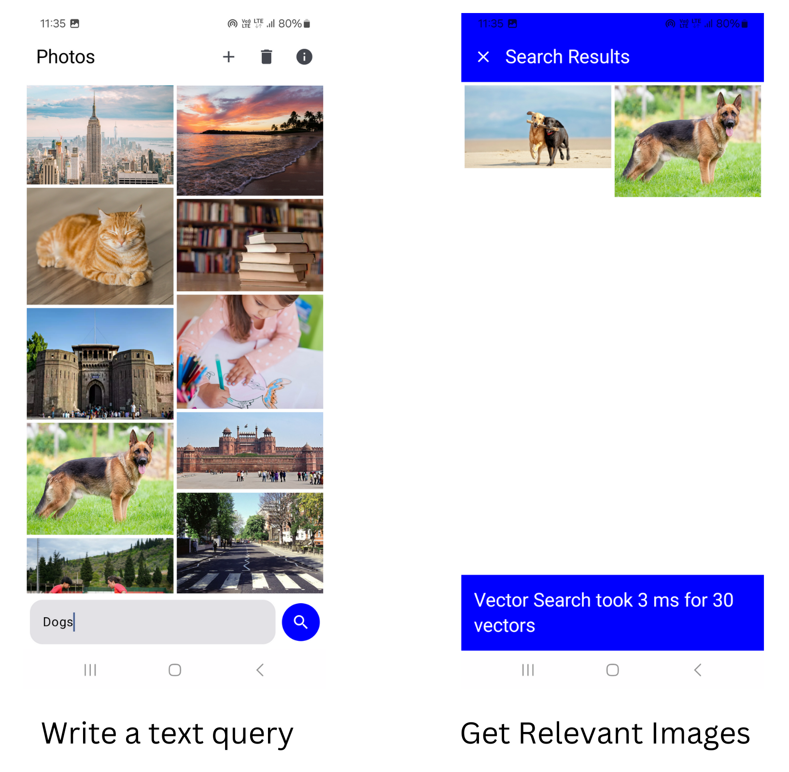
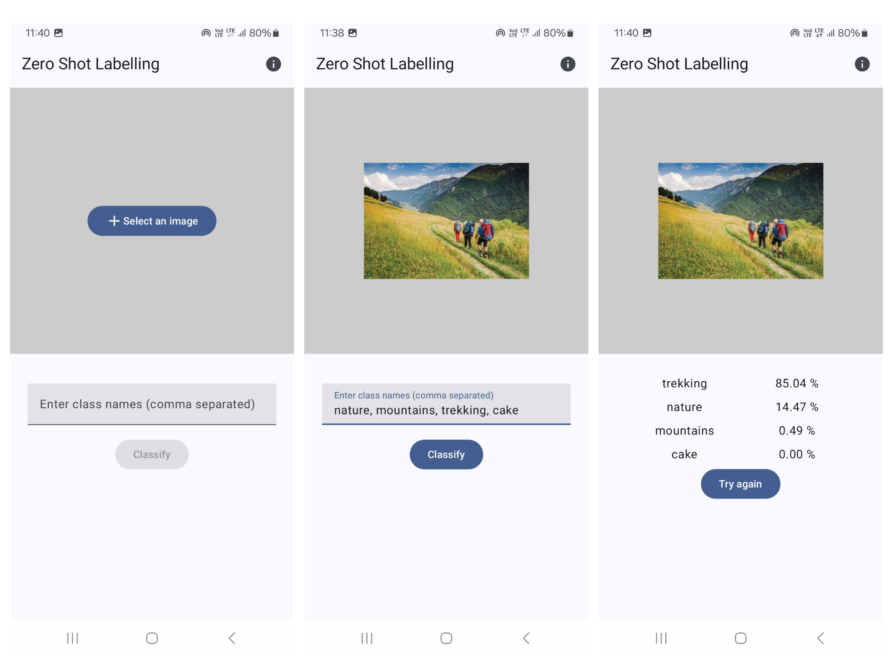

# CLIP - Android Demo

> Android apps which demonstrate the use of OpenAI's CLIP model for zero-shot image classification
> and text-image retrieval using [clip.cpp](https://github.com/monatis/clip.cpp)




* Fully on-device inference of the CLIP model (generate text and image embeddings)
* Uses JNI bindings over [clip.cpp](https://github.com/monatis/clip.cpp) which itself is based
  on [ggml](https://github.com/ggerganov/ggml) for efficient inference 

## Project Setup

The project consists of two Gradle modules, `app-zero-shot-classify` and `app-text-image-search`
which contain the sources files for the 'Zero Shot Image Classification' and `Text-Image-Search'
apps respectively.

1. Clone the project and open the resulting directory in Android Studio. An automatic Gradle build
   should start, if not click on the `Build` menu and select `Make Project`.

```commandline
git clone https://github.com/shubham0204/CLIP-Android --depth=1
```

2. Connect the test-device to the computer and make sure that the device is recognized by the
   computer.

3. Download one of the GGUF models from the [HuggingFace repository](https://huggingface.co/my). For
   instance, if we download the `CLIP-ViT-B-32-laion2B-s34B-b79K_ggml-model-f16.gguf` model, we need
   to push it to the test-device's file-system using `adb push`,

```commandline
adb push CLIP-ViT-B-32-laion2B-s34B-b79K_ggml-model-f16.gguf /data/local/tmp/clip_model_fp16.gguf
```

> [!INFO]
> It is not required to place the GGUF model in the `/data/local/tmp` directory. A path to the app's
> internal storage or any other directory which the app can accessible is also allowed.

4. For both modules, in `MainActivityViewModel.kt`, ensure that the `MODEL_PATH` variable points to
   the correct model path on the test-device. For instance, if the model is pushed
   to `/data/local/tmp/clip_model_fp16.gguf`, then the `MODEL_PATH` variable should be set
   to `/data/local/tmp/clip_model_fp16.gguf`. Moreover, you can configure `NUM_THREADS`
   and `VERBOSITY` variables as well.

```kotlin
private val MODEL_PATH = "/data/local/tmp/clip_model_fp16.gguf"
private val NUM_THREADS = 4
private val VERBOSITY = 1
```

5. Select one of the module in the `Run / Debug Configuration` dropdown in the top menu bar, and run
   the app on the test-device by clicking on the `Run` button (Shift + F10) in Android Studio.

## Adding `CLIPAndroid` to your project

1. Navigate
   to [this fork of clip.cpp](https://github.com/shubham0204/clip.cpp/tree/add-android-sample) and
   clone the branch (`add-android-sample`) and open the resulting directory in Android Studio.

2. The project contains two modules, `app` and `clip`. The AAR of the `clip` module can be found in
   the `app-text-image-search/libs` and `app-zero-shot-classify/libs` directories of this project.
   Running `gradlew clip:assemble` should build the debug and release versions of `clip` as an AAR.

3. The AAR can be added to the `libs` directory of your project and added as a dependency in
   the `build.gradle` file of the app module.

```kotlin
dependencies {
    // ...
    implementation(files("libs/clip.aar"))
    // ...
}
```

## Useful Resources

* [CLIP: Connecting Text and Images](https://openai.com/research/clip)
* [Learning Transferable Visual Models From Natural Language Supervision](https://arxiv.org/abs/2103.00020)
* [clip.cpp](https://github.com/monatis/clip.cpp)
* [ggml](https://github.com/ggerganov/ggml)
* [shubham0204's PR that adds JNI bindings to clip.cpp](https://github.com/monatis/clip.cpp/pull/101)

## Citation

```text
@article{DBLP:journals/corr/abs-2103-00020,
  author       = {Alec Radford and
                  Jong Wook Kim and
                  Chris Hallacy and
                  Aditya Ramesh and
                  Gabriel Goh and
                  Sandhini Agarwal and
                  Girish Sastry and
                  Amanda Askell and
                  Pamela Mishkin and
                  Jack Clark and
                  Gretchen Krueger and
                  Ilya Sutskever},
  title        = {Learning Transferable Visual Models From Natural Language Supervision},
  journal      = {CoRR},
  volume       = {abs/2103.00020},
  year         = {2021}
}
```